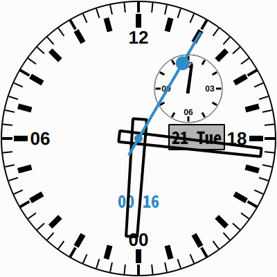
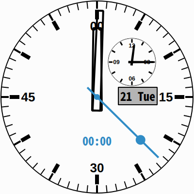

# AnalogClock

A sleek, 24-hour transparent analog clock built with **Qt6** and customized for a professional workflow. This project is a modern evolution of the classic Qt "analogclock" example, developed in collaboration with Gemini.

## Key Features

* **Unique 24-Hour Main Dial**: Designed with "00" at the bottom (6 o'clock position) for a distinct, instrument-like feel.
* **High-Precision Stopwatch**: Features a "smooth-glide" seconds hand (40ms update interval) for seamless movement.
* **Dual-Time Subdial**: A 12-hour subdial ensures you never lose track of real-time while using the stopwatch.
* **Desktop-Friendly UI**: Frameless, transparent, and "always on top" — designed to live elegantly on your Linux desktop.

## Usage

* **Drag**: Left-click and hold anywhere to move the clock.
* **Resize**: Use the mouse wheel to scale the UI.
* **Stopwatch**: Right-click to access the context menu (Start / Stop / Reset).

## Description

### Subdial #1
The upper-right subdial functions as a standard 12-hour clock. When the stopwatch is active, a minute hand appears here to track elapsed time.

### Main Dial
The main dial serves as both a 24-hour clock and a high-precision stopwatch. The accent-colored (Cyan) seconds hand moves with 40ms granularity, providing a high-end mechanical watch experience.

## Technical Details

* **Framework**: Qt 6.10+
* **Graphics**: Antialiased QPainter with `WA_TranslucentBackground`.
* **Timing**: Precision tracking using `QElapsedTimer` for the stopwatch logic.

## Images

