# AnalogClock

**Qt6** で構築され、プロフェッショナルなワークフロー向けにカスタマイズされた、洗練された 24 時間表示の透過型アナログ時計です。このプロジェクトは、Qt の古典的な「analogclock」サンプルを現代的に進化させたもので、Gemini との共同開発によって生まれました。

## 主な特徴

* **ユニークな 24時間メインダイヤル**: 「00」を最下部（通常の 6 時の位置）に配置し、計器のような独特の操作感を実現しました。
* **高精度ストップウォッチ**: 40ms の更新間隔による「スムーズ・グライド」秒針を採用し、滑らかな動きを実現しています。
* **デュアルタイム・サブダイヤル**: 12 時間表示のサブダイヤルを搭載。メインダイヤルがストップウォッチモードの間も、現在時刻を独立して刻み続けます。
* **デスクトップに馴染む UI**: 枠なし（フレームレス）、背景透過、および「常に最前面表示」に対応。Linux デスクトップ上にエレガントに常駐できるよう設計されています。
* **ダイナミックなサイズ変更**: マウスホイールを前後にスクロールするだけで、UIの大きさを自由に変更できます。
* **文字盤パーツの表示カスタマイズ**: 外枠、目盛り、数字、サブダイヤルなど、各パーツの表示/非表示を個別に切り替え可能です。
* **描画色の手動反転機能**: 時計が背景の壁紙やウィンドウに溶け込んでしまわないよう、コンテキストメニューから一発で「白ベース/黒ベース」の配色を反転できます。

## 操作方法

* **移動**: ウィンドウ上の任意の場所を左クリックしてドラッグすると、時計を移動できます。
* **サイズ変更**: マウスホイールを使用して、時計の拡大・縮小が可能です。
* **ストップウォッチ**: 右クリックメニューから、ストップウォッチの開始 / 停止 / リセットが可能です。
* **表示の切り替え**: 右クリックメニューの「Customization Options」から、分目盛り、時目盛り、サブダイヤルなどの表示・非表示を切り替えられます。

## 機能説明

### サブダイヤル #1

右上にあるサブダイヤルは、標準的な 12 時間計として機能します。「メインダイヤルがストップウォッチで遊んでいる間も、サブダイヤルだけは静かに現実の時間を刻み続ける」という設計思想に基づき、ストップウォッチモード中も常に正確な現在時刻を表示し続けます。

### メインダイヤル

メインダイヤルは、24時間計と高精度ストップウォッチの両方の役割を果たします。アクセントカラー（シアン/レッド）の秒針は 40ms 単位で細かく動き、高級機械式時計のスイープ運針のような美しい体験を提供します。

## 技術詳細

* **フレームワーク**: Qt 6.11 (Linux), Qt 6.11 (Windows)
* **グラフィックス**: アンチエイリアスを効かせた `QPainter` と `WA_TranslucentBackground` を使用。
* **タイミング**: ストップウォッチのロジックには `QElapsedTimer` を使用し、精密な計測を行っています。

## スクリーンショット v0.3.0

| 時計モード（全パーツ描画） | ストップウォッチモード | 描画色反転 |
| :----------------------: | :------------------: | :-----: |
| 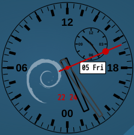 | 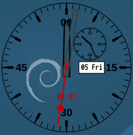 | 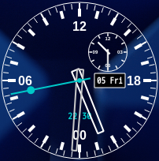 |

| 短針のみ表示 | 時マーカーなし | 分目盛りなし |
| :-----: | :---------: | :---------: |
| 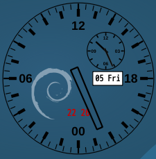 | 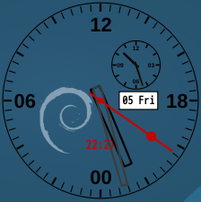 | 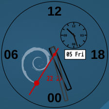 |

| サブダイヤルなし | デジタル表示なし | 日付表示なし |
| :-----: | :---------: | :---------: |
| 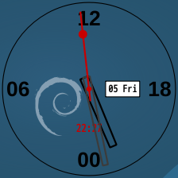 | 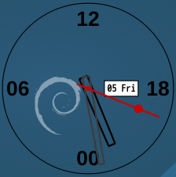 | 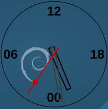 |

| 数字なし | 外枠なし | 短針のみ（ミニマル） |
| :-----: | :---------: | :---------: |
| 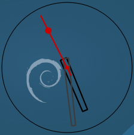 | 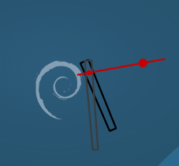 | 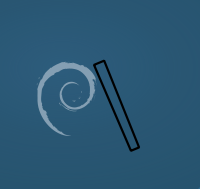 |