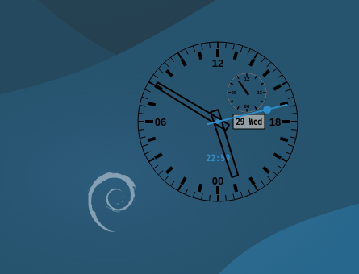
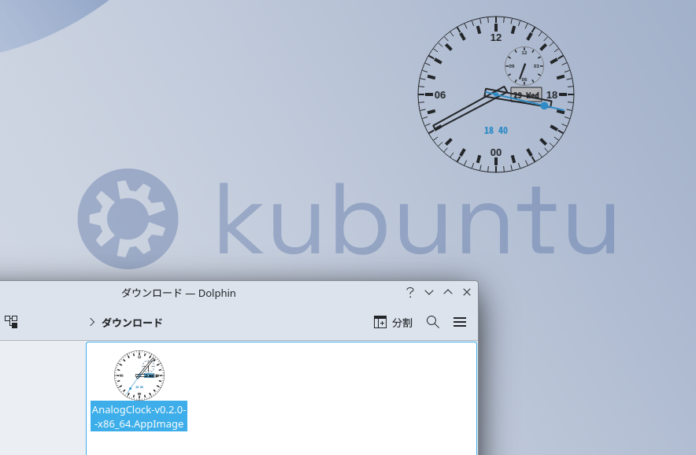
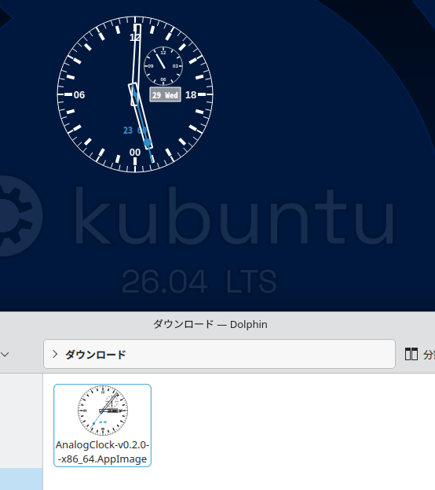
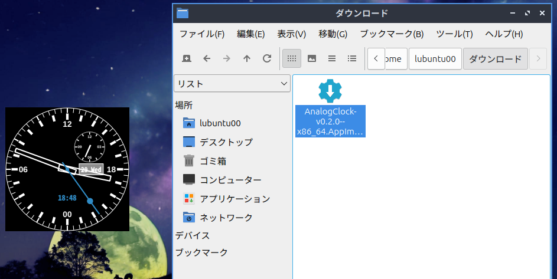
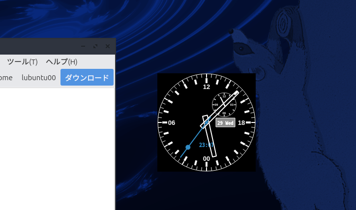
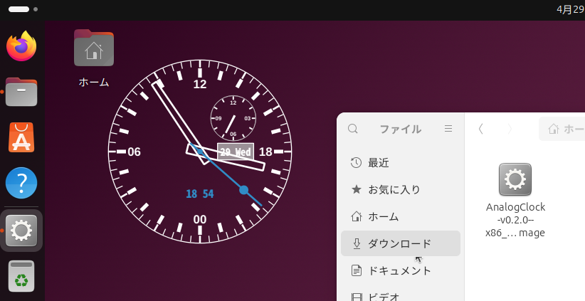
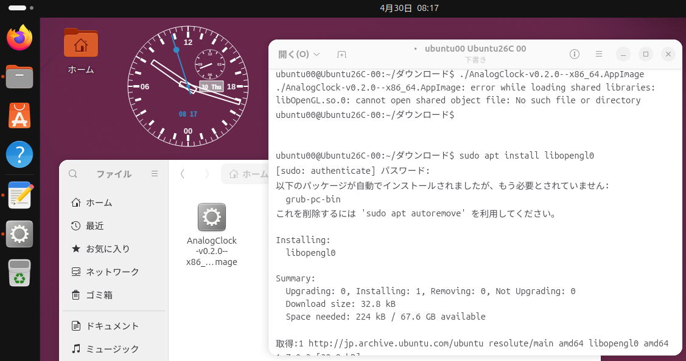
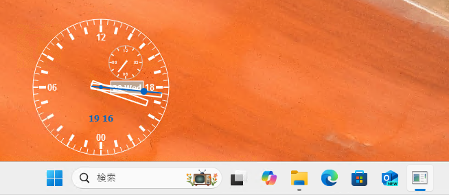

# Runnging Images

これらの動作確認は、**v0.2.0**のバイナリを`Hyper-V`環境下で実行したものです。

各OSのインストール直後の状態で実施しています。OSによっては移動時の動作がカクつくことがあるかもしれません。時計の針の動き自体は問題ないと思われます。また、ストップウォッチの機能も問題ありませんでした。

白黒反転機能も大丈夫でした。

>Lubuntuだけは、背景透過ができません。Lubuntuの高速描画の方向性と、この時計の背景透過機能が相いれないものと思いますので、ここは断念しています。

- Hyper-V設定は、すべて以下となります。
  - 4Core
  - 4GB Memory
  - 60GB Disk (virtual)

## Debian 13.4.0

Debian13で動くことを確認しました。

## Kubuntu 24.04.4

Kubuntu 24.04.4で動くことを確認しました。

Kubuntuでは、実行イメージのアイコンが同梱したイメージに代わるのがおしゃれです。

## Kubuntu26.04

Kubuntu 26.04で動くことを確認しました。こちらも実行イメージのアイコンがおしゃれになります。

## Lubuntu 24.04.4

Lubuntu 24.04.4で動くことを確認しました。

しかし、背景が透過になることはありませんでした。軽量化OSの方針に従います。

## Lubuntu 26.04

Lubuntu 26.04で動くことを確認しました。

こちらも、背景が透過になることはありませんでした。

## Ubuntu 24.04.3

Ubuntu 24.04.3で動くことを確認しました。

Fuseの問題が出ると思ったのですが、インストール直後ではうまく動きました。各アプリをインストールしていく段階で動かなくなる可能性はあるかもしれません。

## Ubuntu 26.04

Ubuntu 26.04で動くことを確認しました。

>キャプチャイメージの通り、`libOpenGL.so`が入っていないためすぐには動きません。このライブラリを入れることで動きます。

## Windows 11

Windows11で動くことを確認しました。

ソースコード自体は、Linuxとほぼ共有です(Qtですので)。

